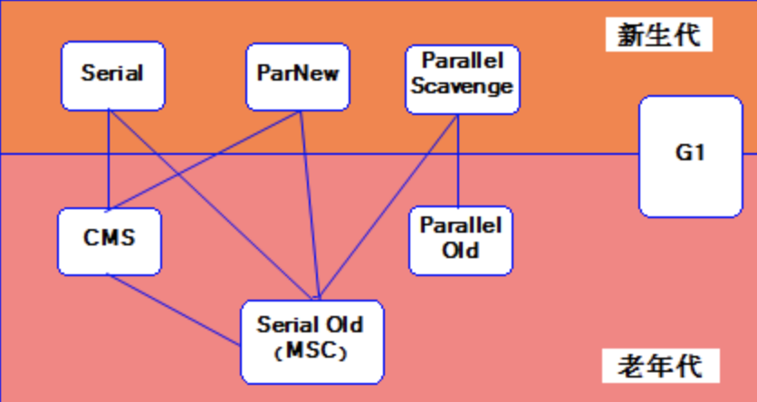

# JVM

## JVM内存区域划分

## 标记算法
### 引用计数法
### GCROOT

## JVM三色标记漏标如何解决
**三色标记**：cms和g1在并发标记期间使用的标记算法，使用三种颜色标记对象，黑色：自身和成员变量都已标记 ，灰色：自身标记，成员变量未全部标记， 白色：自身和成员都未标记， 标记结束之后，白色即为垃圾。

**漏标出现的2个充要条件**： 
1.灰色对象在自己扫描完成之前删除了一个白色对象（导致这个白色对象扫描不到） 
2.又有一个黑色对象在自己被标记完之后指向了这个白色对象（导致这个白色对象被引用）

**CMS垃圾回收器的解决方式**：采用写屏障记录增量更新（破坏条件2），即记录新添加引用的关系保存在集合中，在重新标记阶段对集合中的引用进行遍历重新扫描（即黑变灰），因为用重新标记阶段要stw，并且重新扫描这些集合中的黑色对象比较耗时，可能会导致过长时间的stw；

**G1回收器的解决方式**：采用写屏障+satb（破坏条件1），satb在标记开始时会做一个快照，在并发标记过程中当灰色对象删除白色对象引用时，会记录起来，在并发标记结束后，根据原始快照对这些白色对象为根进行重新扫描（白变灰），但这有个缺点，有可能这些白色对象被删除引用之后没有黑色对象去指向他，导致这个白色对象没有被回收（浮动垃圾），下一次GC回收，但会比增量更新更省时间

**zgc的解决方式**：采用的是读屏障，因为引用标记或移动时都要先读取，所以通过读屏障操作着色指针能确保gc时读取数据的正确性

## 垃圾回收器

## G1回收器
### Rset 、cardTable理解
jvm存在跨代引用的情况，当老年代引用新生代的时候，新生代被引用的对象是不能被回收的，为了避免这种跨代引用要扫描整个老年代的情况，有了Rset和cardTable。
#### Rset
ponit-in结构，每个region都有一个rset，记录了别的region对本region的引用，可以理解为记录了某某region的哪些卡页引用了本region
#### cardtable
ponit-out结构，每个region被划分为512个card页，一个卡页往往存在多个对象，当一个卡页内有一个或一个以上的对象引用了别的region的对象时，这个card就会被标记为1即脏卡

在ygc的时候，扫描新生代的region，根据Rset找到哪个region引用的当前这个region，而脏卡是用来更新Rset的，根据脏卡中的引用关系来更新Rset

## GC调优
### CMS
查看gc日志  
如果是年轻代回收次数很多，可以调整年轻代大小、e区和s区的比值  
如果是晋升失败或者con mode fail，可以调整XX:CMSInitiatingOccupancyFraction  XX:UseCMSCompactAtFullCollection   XX:CMSFullGCsBeforeCompaction  
如果是方法区溢出，可以调整元空间大小  
另外老年代吃紧的时候除了参数调整，更多要考虑代码优化，看代码中有没有内存泄露、有没有哪里加载大量数据（考虑使用分页） 

### G1：
G1有自适应性，一般只要设置预期停顿时间和堆的最大最小值就可以开始工作，偶尔可以微调参数，调的时候注意几个点  
避免显式指定年轻代大小，因为会覆盖暂停时间目标  
暂停时间目标设置需要权衡，可能会影响吞吐量  
在熟悉mixed gc的情况下，可以调整mixed gc参数 